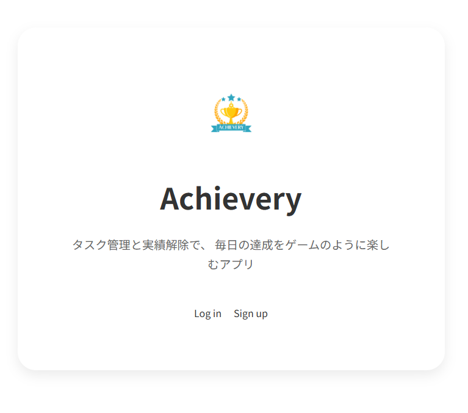
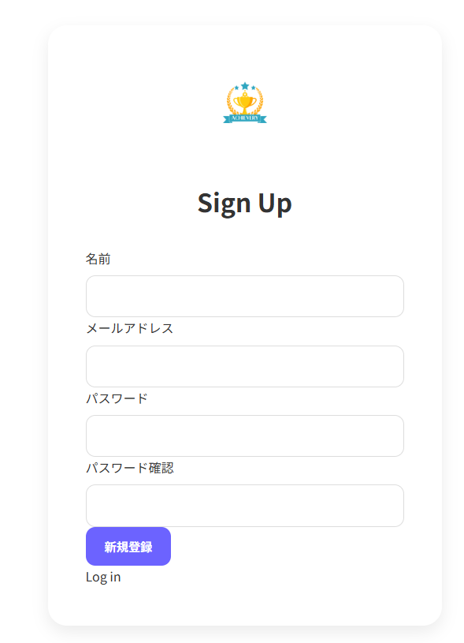
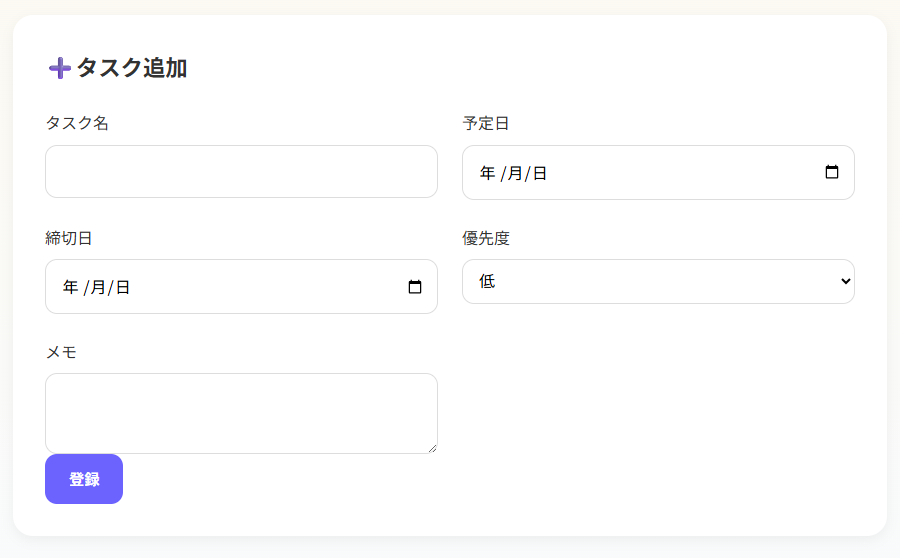
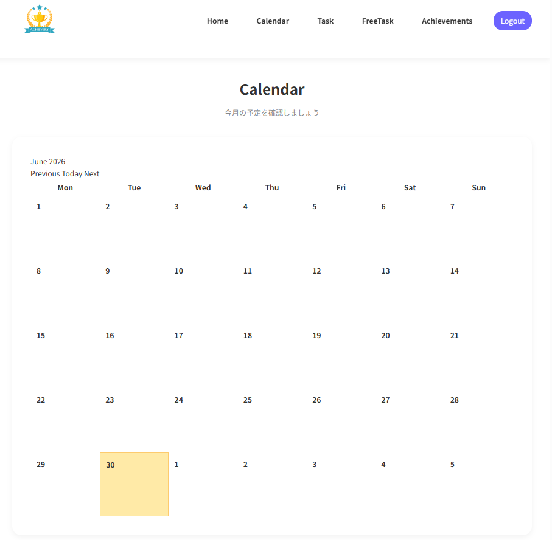
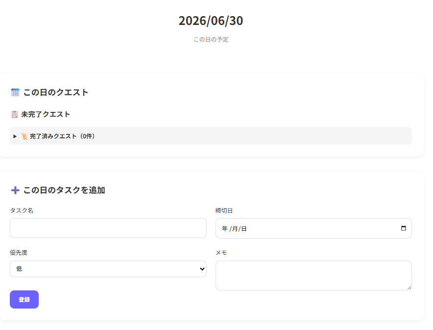
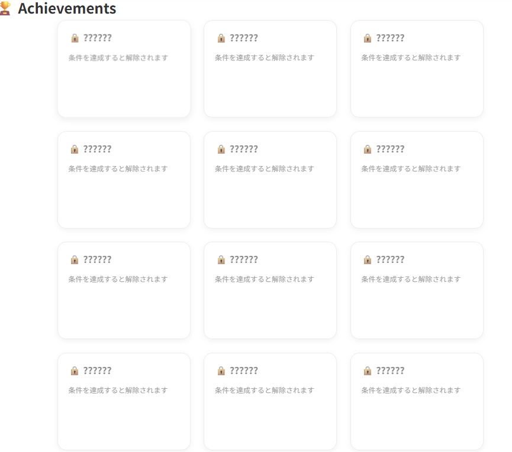

# Achievery(アチーブリー)

# 概要
このアプリは、毎日のタスクをゲームのクエスト感覚で管理する、継続支援型スケジュール管理アプリケーションです。
日付ごとの予定官吏だけではなく、期限に縛られない自由なタスクも管理できるよう設計しています。
タスク完了時の視覚的な変化や、今後実装予定の実績解除機能によって、「やるべきことをやる」ばかりでない、「続けたくなる体験」を目指しています。

# サイトテーマ
「毎日のこつこつしたタスクの完了を気持ちよく」

## テーマを選んだ理由
### きっかけ
タスク管理アプリは数多く存在しますが、管理機能のみの簡素なものが中心となっているため、継続モチベーションを保つのには向いていないと感じることが多くありました。
日常のこまごました「やるべきこと」を達成感をもって続けられるサービスがあれば、日々の学習や毎日の雑事を楽しく行えると思い、制作を始めました。

### 問題点
- タスク管理アプリは「管理」に寄りすぎていて、継続のモチベーションが続きにくい
- 生活の中には「今日中にやるべきこと」と「いつか進めたいこと」が混在しているが、一元化されていないタスク管理アプリも多い

### 解決策
- タスク完了時に実績の機能をつけることで、ゲーム感覚でタスクを処理できるようにする
- スケジュールに紐づいた「その日」のタスクと、長期的なタスクの両方を扱えるようにする

# ターゲットユーザー
- Todo管理が続かない人
- タスク管理を少しでも楽しくしたい人
- 小さな達成感を積み重ねたい人
- ゲームの実績解除のような演出が好きな人
- 「今日やること」と「長期タスク」を分けて管理したい人

# 主な利用シーン
- 資格の勉強など、継続的に行うべきタスクがあるとき
- スケジュールの管理とTodoリストを一元化したいとき
- 引っ越し等の複数の手続きや日ごとのやるべきことが多く重なるタイミングのタスク管理がしたいとき

# 利用方法
- ユーザー新規登録あるいはログインする

- タスクを追加する

- カレンダー画面で日付に紐づいたタスクを確認する

- タスクの完了に応じて実績が解放

# 機能一覧
- ユーザー登録・ログイン
- タスク管理
- 作成
- 完了
- 削除
- カレンダー表示
- フリータスク管理
- 優先度設定
  - 👑 Boss
  - ⚔️ Normal
  - 🌱 Easy
- 締切表示
- 実績解除
- 実績一覧

# 開発環境
## 使用技術
| カテゴリ | 技術 |
|----------|------|
| OS | Windows 11 |
| エディタ | Visual Studio Code |
| ターミナル | Git Bash |
| 言語 | HTML / CSS / JavaScript / Ruby 3.2 |
| フレームワーク | Ruby on Rails 8.1.3 |
| データベース | SQLite3 |
| フロントエンド | Bootstrap / Turbo |
| 認証 | Devise |
| カレンダー | Simple Calendar |
| バージョン管理 | Git / GitHub |